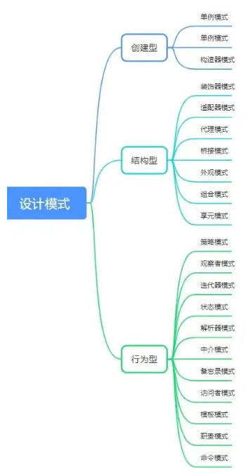
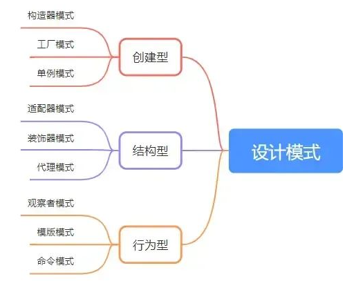

---
# 这是文章的标题
title: 前端设计模式
# 你可以自定义封面图片
# cover: /assets/images/cover1.jpg
# 这是页面的图标
icon: file
# 这是侧边栏的顺序
order: 1
# 设置作者
author: moonandcake
# 设置写作时间
date: 2023-12-08
# 一个页面可以有多个分类
# category:
#   - 使用指南
# 一个页面可以有多个标签
# tag:
#   - 页面配置
#   - 使用指南
# 此页面会在文章列表置顶
sticky: false
# 此页面会出现在文章收藏中
star: true
# 你可以自定义页脚
footer:
# 你可以自定义版权信息
copyright:
---

<!-- more -->

## 六大原则：

- 依赖倒置原则(Dependence Inversion Principle)：高层(业务层)不应该直接调用底层(基础层)模块
- 开闭原则(Open Close Principle)：单模块对拓展开放、对修改关闭
- 单一原则(Single Responsibility Principle)：单模块负责的职责必须是单一的
- 迪米特法则(Law of Demeter)：对外暴露接口应该简单
- 接口隔离原则(Interface Segregation Principle)：单个接口(类)都应该按业务隔离开
- 里氏替换原则(Liskov Substitution Principle)：子类可以替换父类
  
        六大原则也可以用六个字替换：高内聚低耦合。
            1.高层不直接依赖底层：依赖倒置原则
            2.内部修改关闭，外部开放扩展：开闭原则
            3.聚合单一功能：单一原则
            4.低知识接口，对外接口简单：迪米特法则
            5.耦合多个接口，不如隔离拆分：接口隔离原则
            6.合并复用，子类可以替换父类：里氏替换原则

## 一、创建型

创建型从功能上来说就是创建元素，目标是规范元素创建步骤

### 1.构造器模式：抽象了对象实例的变与不变(变的是属性值，不变的是属性名)

    // 需求：给公司员工创建线上基本信息
    // 单个员工创建，可以直接使用创建
    const obj = {
        name:'张三',
        age:'20',
        department:'人力资源部门'
    }
    // 可员工的数量过于多的时候，一个个创建不可行，那么就可以使用构造器模式
    class Person {
        constructor(obj){
            this.name = obj.name
            this.age = obj.age
            this.department = obj.department
        }
    }
    const person1 = new Person(obj)

### 2. 工厂模式：为创建一组相关或相互依赖的对象提供一个接口，且无须指定它们的具体类

即隐藏创建过程、暴露共同接口。

    // 需求：公司员工创建完信息后需要为每一个员工创建一个信息名片
    class setPerson {
        constructor(obj) {
            this.pesonObj = obj
        }
        creatCard() {
            //创建信息名片
        }
        otherFynction(){
        
        }
    }
    class Person {
        constructor(obj) {
            return new setPerson(obj)
        }
    }
    const person = new Person()
    const card = person.creatCard({
        name:'张三',
        age:'20',
        department:'人力资源部门'
    })

### 3. 单例模式：全局只有一个实例，避免重复创建对象，优化性能
    // 需求：判断一款应用的开闭状态，根据不同状态给出不同提示
    class applicationStation {
        constructor() {
            this.state = 'off'
        }
        play() {
            if (this.state === 'on') {
                console.log('已打开')
                return
            }
            this.state = 'on'
        }
        shutdown() {
            if (this.state === 'off') {
                console.log('已关闭')
                return
            }
            this.state = 'off'
        }
    }
    window.applicationStation = new applicationStation()
    // applicationStation.instance = undefined
    // applicationStation.getInstance = function() {
    //    return function() {
    //        if (!applicationStation.instance) {  // 如果全局没有实例再创建
    //            applicationStation.instance = new applicationStation()
    //        }
    //        return applicationStation.instance
    //    }()
    // }
    // application1和application2拥有同一个applicationStation对象
    const application1 = window.applicationStation
    const application2 = window.applicationStation

## 二、结构型
结构型从功能上来说就是给元素添加行为的，目标是优化结构的实现方式
### 1. 适配器模式:适配独立模块，保证模块间的独立解耦且连接兼容
    // 需求：一个港行PS，需要适配插座国标
    class HKDevice {
        getPlug() {
            return '港行双圆柱插头'
        }
    }

    class Target {
        constructor() {
            this.plug = new HKDevice()
        }
        getPlug() {
            return this.plug.getPlug() + '+港行双圆柱转换器'
        }
    }

    const target = new Target()
    target.getPlug()
### 2. 装饰器模式：动态将责任附加到对象之上
    // 说回我们之前说的为公司员工创建名片需求，现在追加需求，要给不同工龄的员工，创建不同的类型名片样式
    //由于的工厂函数还有其他各种方法，不好直接改动原工厂函数，这时候我们可以使用装饰器模式实现
    class setPerson {
        constructor(obj) {
            this.pesonObj = obj
        }
        creatCard() {
            //创建信息名片
        }
        otherFynction(){
        
        }
    }
    // 追加
    class updatePerson {
        constructor(obj) {
            this.pesonObj = obj
        }
        creatCard() {
            this.pesonObj.creatCard()
            if(this.pesonObj.seniorityNum<1){
                this.update(this.pesonObj)
            }
        }
        update(pesonObj) {
            //追加处理
        }
    }

    const person = new setPerson()
    const newPerson = new updatePerson(person)
    newDevice.creatCard()
### 3. 代理模式：使用代理人来替代原始对象处理更专业的事情
    // 需求：在单例模式中，我们实现了应用状态的判断，现在，我们需要控制这个应用要在登录注册的情况下才能使用,可以通过代理模式，讲这个需求代理给专门拦截的对象进行判断
    class applicationStation {
        init() {
            return 'hello'
        }
    }

    class User {
        constructor(loginStatus) {
            this.loginStatus = loginStatus
        }
    }

    class applicationStationProxy {
        constructor(user) {
            this.user = user
        }
        init() {
            return this.user.loginStatus ? new applicationStation().init() : please Login
        }
    }

    const user = new User(true)
    const userProcy = new applicationStationProxy(user)
    userProcy.init()
## 三、行为型
不同对象之间责任的划分和算法的抽象化
### 1. 观察者模式:当一个属性发生变化时，观察者会连续引发所有的相关状态变更
    // 需求：通过智能家居中心一键控制系统
    class MediaCenter {
        constructor() {
            this.state = ''
            this.observers = []
        }
        attach(observers) {
            this.observers.push(observers)
        }
        getState() {
            return this.state
        }
        setState(state) {
            this.state = state
            this.notifyAllobservers()
        }
        notifyAllobservers() {
            this.observers.forEach(ob => {
                ob.update()
            })
        }
    }

    class observers {
        constructor(name, center) {
            this.name = name
            this.center = center
            this.center.attach(this)
        }
        update() {
            // 更新状态
            this.center.getState()
        }
    }
### 2. 模版模式：在模版中，定义好每个方法的执行步骤。方法本身关注于自己的事情
    // 需求：新员工入职，按照规定流程，进行相关培训和办理好员工相关资料
    class EntryPath {
        constructor(obj) {
        // some code
        }
        init() {
            // 初始化员工信息
        }
        creatCard() {
            // 创建员工名片
        }
        inductionTraining() {
            // 入职培训
        }
        trainingExamination() {
            // 训后测试
        }
        personEntry() {
            this.init()
            this.creatCard()
            this.inductionTraining()
            this.trainingExamination()
        }
    }
### 3. 命令模式:请求以指令的形式包裹在对象中，并传给调用对象
    // 需求:游戏角色的控制
    // 接受者
    class Receiver {
        execute() {
            // 奔跑
        }
    }
    // 操控者
    class Operator {
        constructor(command) {
            this.command = command
        }
        run() {
            this.command.execute()
        }
    }
    // 指令器
    class command {
        constructor(receiver) {
            this.receiver = receiver
        }
        execute() {
            // 逻辑
            this.receiver.execute()
        }
    }
    const soldier = new Receiver()
    const order = new command(soldier)
    const player = new Operator(order)
    player.run()